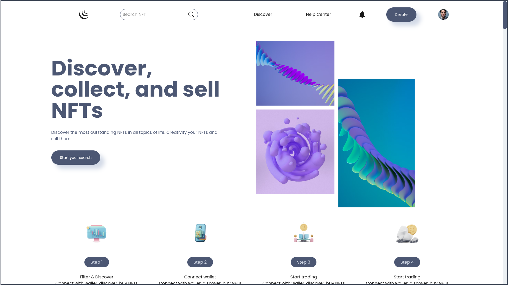
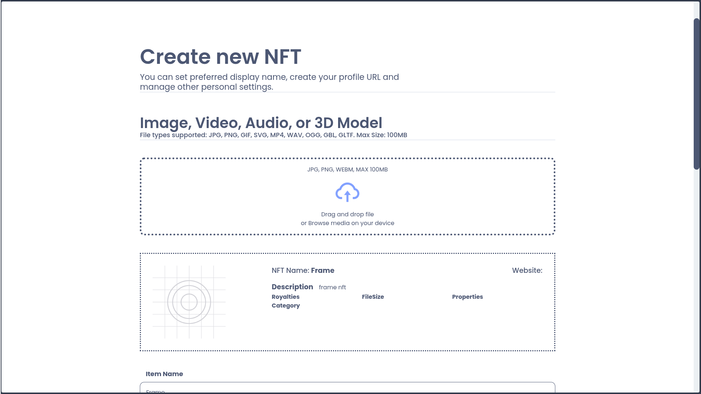
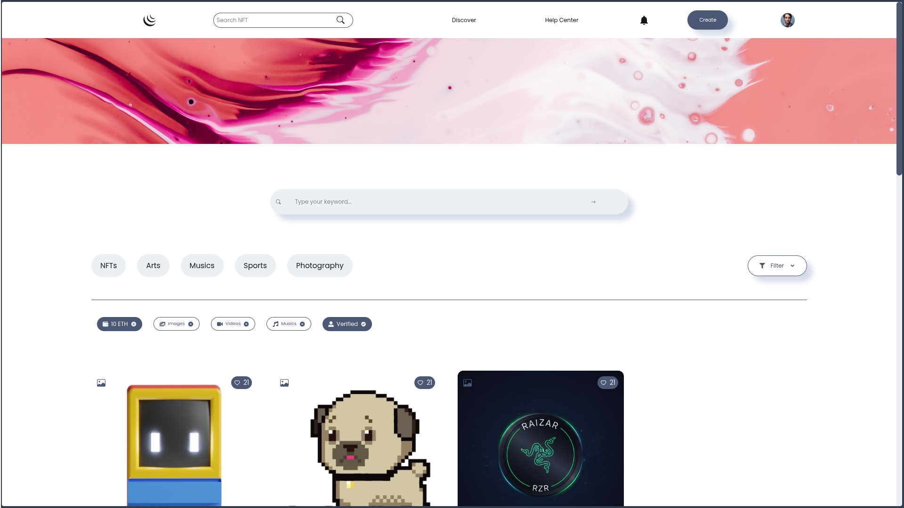
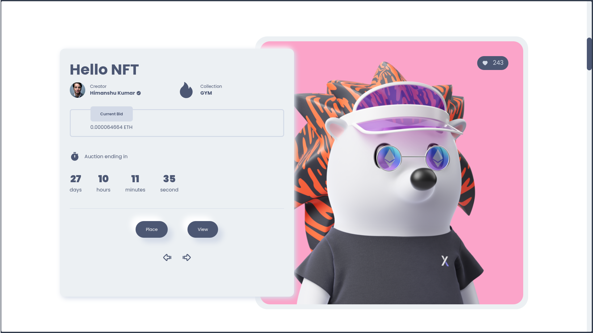
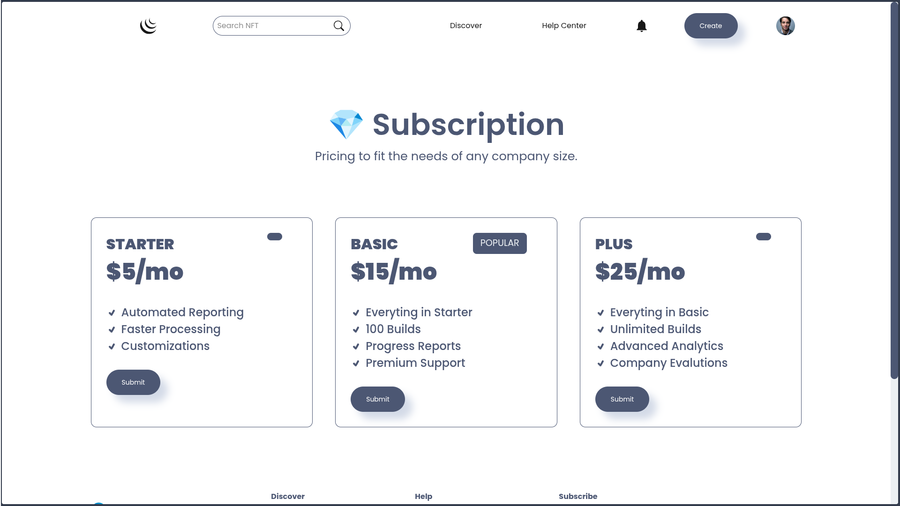

# 🖼️ Decentralized NFT Marketplace

A high-performance, full-stack NFT marketplace protocol built for the modern decentralized web. This platform enables users to mint, buy, sell, and resell digital assets with institutional-grade security and a premium user experience.

## 🚀 Key Features

- **Decentralized Minting**: Permissionless NFT creation with IPFS-ready metadata integration.
- **Liquidity Management**: Secure smart contract-based marketplace for secondary sales and immediate settlements.
- **Curated Creator Metrics**: Automated tracking of top-performing creators and asset provenance.
- **High-Fidelity UI**: Responsive design powered by Framer Motion for smooth, high-end transitions and micro-animations.
- **Enterprise-Ready Search**: Optimized indexing and filtering for seamless asset discovery.

## 🛠️ Tech Stack

- **Smart Contracts**: Solidity, OpenZeppelin (ERC721), Hardhat
- **Frontend**: Next.js 16 (App Router), React 19, Tailwind CSS 4
- **Blockchain Interaction**: Ethers.js v6, Web3Modal
- **Media Handling**: React Dropzone, Axios
- **UI/UX**: Framer Motion, React Icons, React Toastify

## 📸 Application Screenshots

Here are some key screenshots from the NFT Marketplace:

  
_Home Page_

  
_Create New NFT Page_

  
_Search NFT Page_

  
_NFT Slider_

  
_Subscription Plan_

---

## ⚙️ Installation & Setup

1. **Clone the repository:**

   ```bash
   git clone <repository-url>
   ```

2. **Setup Smart Contracts:**

   ```bash
   cd NFTSMARTCONTRACT
   npm install
   npx hardhat compile
   # Deploy locally
   npx hardhat node
   npx hardhat ignition deploy ./ignition/modules/NFTMarketplace.js --network localhost
   ```

3. **Setup Frontend:**

   ```bash
   cd ../nftfrontend
   npm install
   npm run dev
   ```

4. **Environment Variables:**
   Configure your `.env` file with the deployed contract address and RPC provider details.
